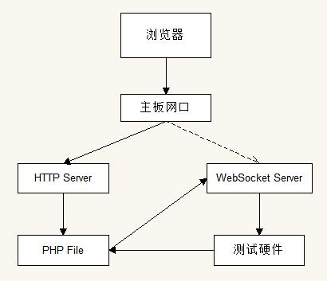

# 硬件测试系统软件需求清单

## 一、硬件平台

硬件主板：SBC-7109PM-454A

## 二、Linux内核版本 

Linux 4.4

## 三、MiniOS测试系统搭建

* 使用[Buildroot](https://buildroot.org/)进行操作系统制作，目前暂定使用[buildroot-2017.05.tar.gz](https://buildroot.org/downloads/)版本：
* 编译说明：
  * 指定编译器下载：[Linaro Releases](https://releases.linaro.org/components/toolchain/binaries/)
  * 使用sysvinit进行系统init启动；
  * 系统软件需求：
    * root账户名：root；
      * 默认密码：aplex；
    * android-tools：这样可以像使用Android ADB一样去控制Linux系统；
    * FTP：最好是vsftp，如果不行，使用任何FTP都行，用于在测试ARM-Settings时不用重复烧录系统；
    * SSH：远程登入控制系统，root账户登录；
    * 支持PHP5：ARM-Settings使用到PHP；
    * 支持http服务：浏览器访问使用的Web Server；
    * 支持libwebsockets：浏览器实时通信WebSocket Server；
    * 支持Can-utils：CAN设备通信配置工具；
    * 支持i2c-tools：I2C通信工具；
    * 支持spi-tools：SPI通信工具；
    * 支持net-tools、iproute2：网络配置工具；

## 四、ARM-Settings测试软件

功能需求如下：

* System Infomation：
  * CPU：显示CPU信息；
  * Processor：显示CPU的核信息；
  * Memery：内存信息；
  * eMMC：内部存储信息；
  * eMMC Available：可用的内部存储信息；
  * Operation System Type：操作系统类型；
  * Linux Version：内核版本；
* Network Configure：
  * DHCP：设置为动态获取IP；
  * Static IP：设置为静态设定IP；
    * IP：设定的静态IP；
    * Netmask：设定的掩码；
    * Broadcast：设定广播地址；
    * Gateway：设定的网关；
  * Ping IP Test：用于测试网络情况；
* Data & Time Setting
  * Data：设置日期;
  * Time：设置时间;
* Update System：
  * U-Boot Update：更新U-Boot；
    * choose file：选择要更新的文件；
    * progress：上传的进程；
    * update button：开始上传、更新；
  * Linux Kernel Update：更新Linux内核；
    * choose file：选择要更新的文件；
    * progress：上传的进程；
    * update button：开始上传、更新；
  * Rootfs Update：更新文件系统；
    * choose file：选择要更新的文件；
    * progress：上传的进程；
    * update button：开始上传、更新；
* Hardware Test：
  * 网络ping局域网测试；
  * 检测RTC时间是否正常；
  * 键盘检测情况；
  * 鼠标检测情况；
  * 网口1检测情况；
  * 网口2检测情况；
  * DB9传感器检测；
  * CON3 USB U盘检测；
  * CON3 I2C传感器检测；
  * CON3 UART传感器检测；
  * COM3 CAN传感器检测；
  * SD卡检测；
  * MIO 8 GPIO测试；
  * MIO USB U盘检测；
  * CN1 I2C检测；

## 五、软件访问流程图

